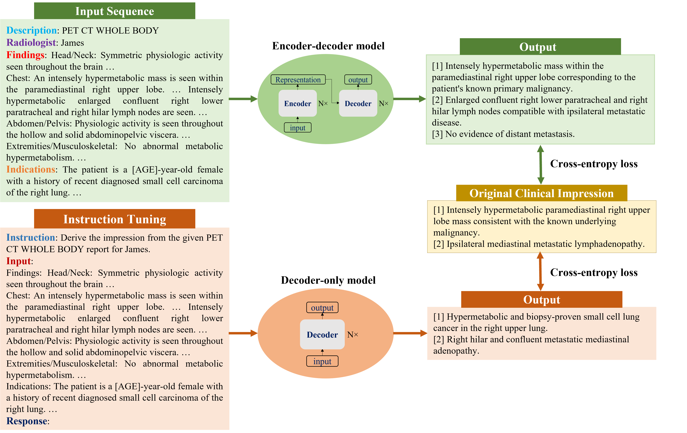

# Fine-tuning Large Language Models (LLMs) for PET Report Summarization :bookmark_tabs:

This repository contains the code for the paper [**Automatic Personalized Impression Generation for PET Reports Using Large Language Models**](#link-to-paper) (under review). 

We shared three implementation methods in this repository: 
- [**fastAI Implementation**](https://github.com/xtie97/PET-Report-Summarization/tree/main/fastAI): simple and easy to use
- [**Non-trainer Implementation**](https://github.com/xtie97/PET-Report-Summarization/tree/main/nontrainer): more flexible
- [**Trainer (with deepspeed) Implementation**](https://github.com/xtie97/PET-Report-Summarization/tree/main/deepspeed): reduce memory usage and accelerate training

## Overview :mag_right:
**Summary**: 
The fine-tuned large language model provides clinically useful, personalized impressions based on PET findings. To the best of our knowledge, this is the first attempt to automate impression generation for whole-body PET reports. 

**Key Points**:
- :chart_with_upwards_trend: Among 30 evaluation metrics, domain-adapted BARTScore and PEGASUSScore exhibited the highest correlations (Spearman's ρ correlation=0.568 and 0.563) with physician preferences, yet they did not reach the level of inter-reader correlation (ρ=0.654).
- :trophy: Of all fine-tuned large language models, encoder-decoder models outperformed decoder-only models, with PEGASUS emerging as the top-performing model.
- :medal_sports: In the reader study, three nuclear medicine physicians considered the overall utility of personalized PEGASUS-generated impressions to be comparable to clinical impressions dictated by other physicians.

## Input Templates :pencil2:
In this work, we investigated both encoder-decoder and decoder-only language models. Considering their different architectures, we customized input templates as illustrated in the figure below. Note that for decoder-only models, we employed the instruction-tuning method and adapted the prompt from [Alpaca](https://github.com/tatsu-lab/stanford_alpaca)
<p align="center">
    
</p>

## Usage: 🚀

We already released our model weights in [**Hugging Face**](https://huggingface.co/xtie/PEGASUS-PET-impression). To generate the impressions, run the following code:

```bash
finetuned_model = "xtie/PEGASUS-PET-impression"
tokenizer = AutoTokenizer.from_pretrained(finetuned_model) 
model = AutoModelForSeq2SeqLM.from_pretrained(finetuned_model, ignore_mismatched_sizes=True).eval()

findings_info =
"""
Description: PET CT WHOLE BODY
Radiologist: James
Findings:
Head/Neck: xxx Chest: xxx Abdomen/Pelvis: xxx Extremities/Musculoskeletal: xxx
Indication:
The patient is a 60-year old male with a history of xxx
"""

inputs = tokenizer(findings_info.replace('\n', ' '),
                  padding="max_length",
                  truncation=True,
                  max_length=1024,
                  return_tensors="pt")
input_ids = inputs.input_ids.to("cuda")
attention_mask = inputs.attention_mask.to("cuda")
outputs = model.generate(input_ids,
                        attention_mask=attention_mask,
                        max_new_tokens=512, 
                        num_beam_groups=1,
                        num_beams=4, 
                        do_sample=False,
                        diversity_penalty=0.0,
                        num_return_sequences=1, 
                        length_penalty=2.0,
                        no_repeat_ngram_size=3,
                        early_stopping=True
                        )
# get the generated impressions
output_str = tokenizer.decode(outputs,
                              skip_special_tokens=True)

```

## Human Evaluation :busts_in_silhouette:
We released the webpage designed for expert review. Feel free to check it out. :point_right: [PET-Report-Expert-Evaluation](https://github.com/xtie97/PET-Report-Expert-Evaluation)

## Citation: 📚

